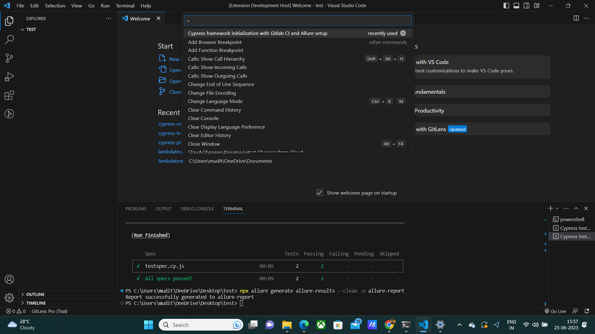
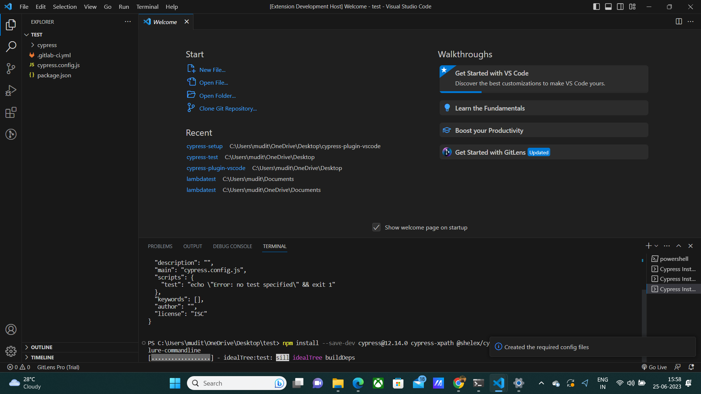
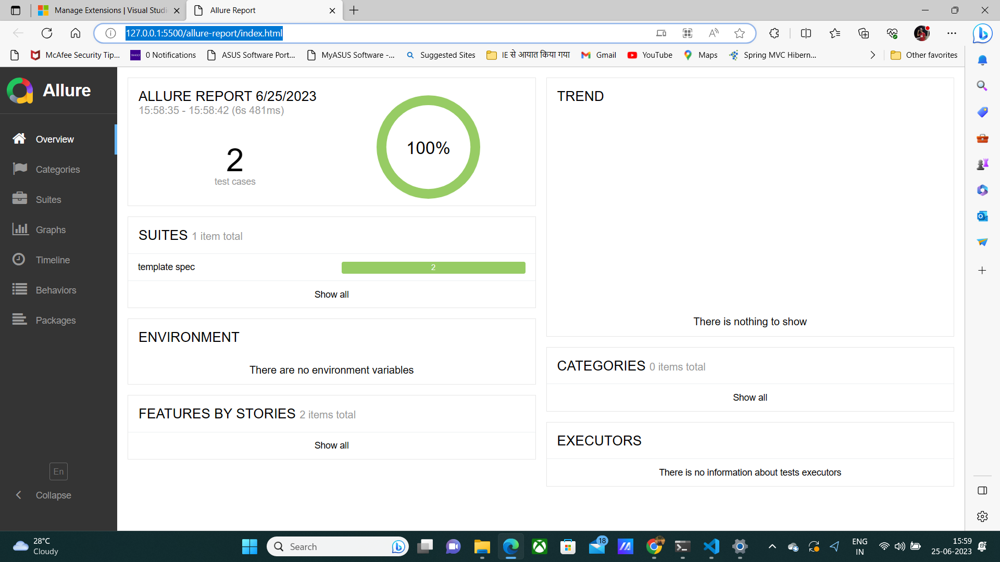

# Cypress Gitlab Allure Setup README
- This is the instruction manual for using the cypress allure gitlab framework generator extension

## How to Use
- Create a VSCode Workspace
- Open the command pallete (Ctrl+Shift+P)
- Search for Cypress framework initialization with Gitlab CI and Allure setup
- Click on it
- Sit back & Relax !. It will automatically generate the configuration files required for cypress, execute sample tests and create   Gitlab CI and allure report for you

## Features

- Users need to have a VS Code Workspace created in order to be able to make use of this plugin

 
## Requirements

- Node version above above 18.0.0 must be installed
- Java version above 8 must be installed
- npm version above 8.x.x must be installed

## Known Issues

Calling out known issues can help limit users opening duplicate issues against your extension.

## Release Notes

### 1.1.2
- Created the changelog.md
- Added the how to use guide
### 1.1.1
- Fixed broken image in README.md
### 1.1.0
- Added screenshots for showing the plugin in action in the README.md
###
- Updated the README.md
- Updated the LICENSE 
### 1.0.3
- Updated the description of the plugin and the name of the plugin
### 1.0.2
- Added logo for the plugin
### 1.0.1
- Removed commented code
### 1.0.0

- Initial release of Cypress Framework Generator with Allure Reporting & Gitlab Ci
- Inspired from the playwright development, I have  created a one click generate template for cypress.
- This template would help initialize a cypress 12.14.0 project with the required files along with allure report generation.
- It also helps in generating .gitlab-ci.yml file for running the tests in gitlab ci 

### Contribution/Feedback

Feel free to reach out to me at https://www.linkedin.com/in/maheshwarimudit/

**Enjoy!**
